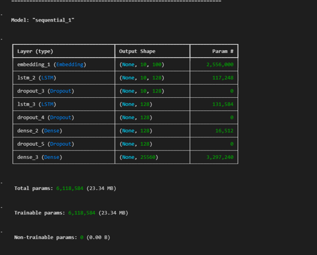
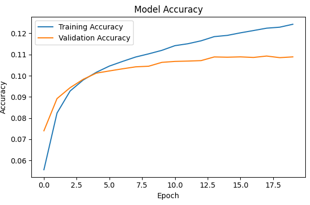
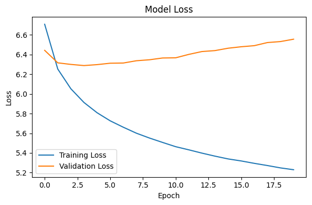
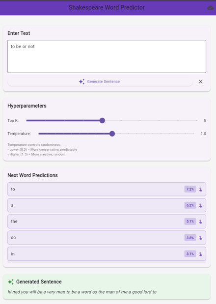
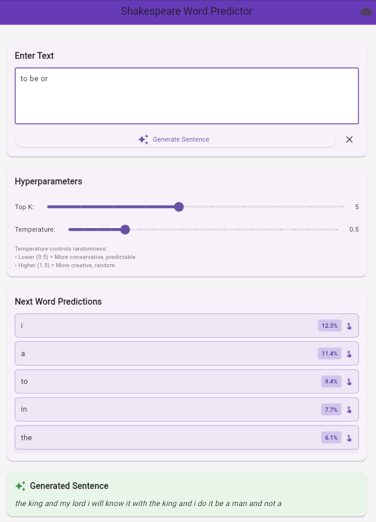
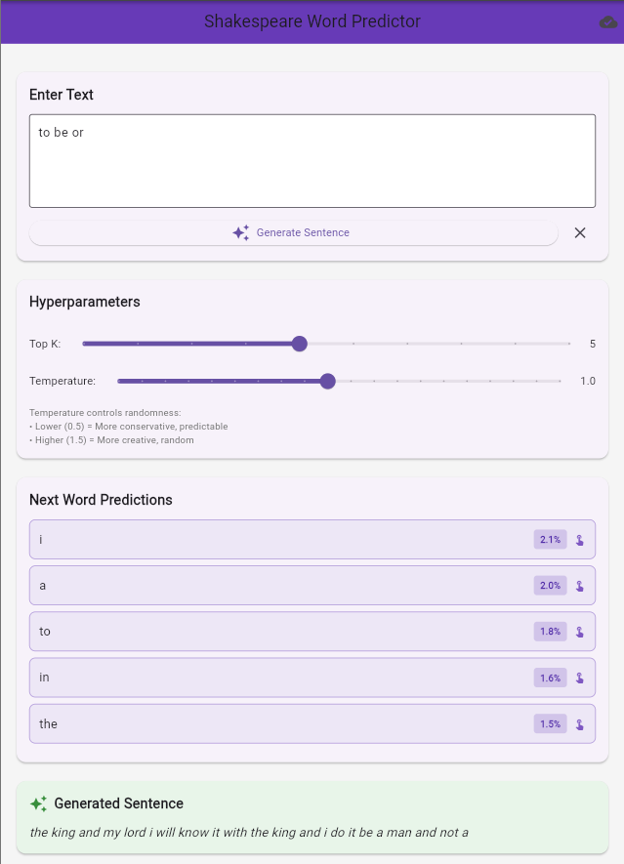
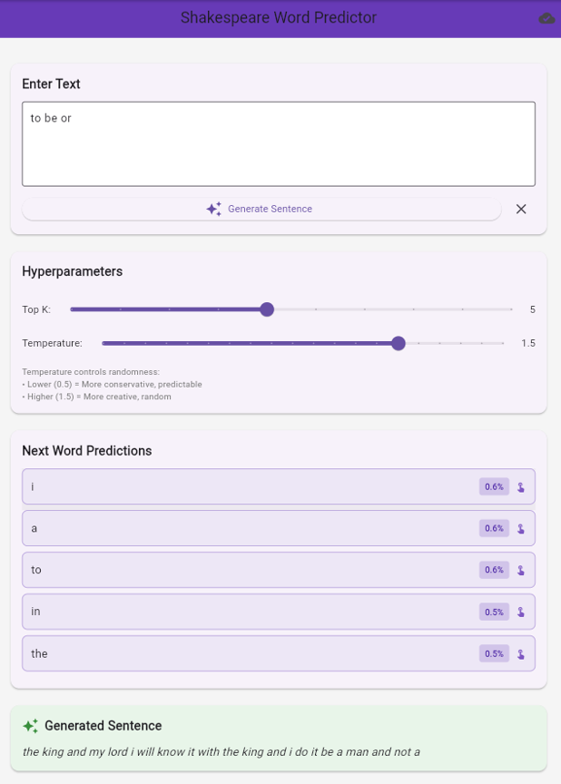

# Shakespeare Next Word Prediction using LSTM

A deep learning project that implements a word-level Long Short-Term Memory (LSTM) neural network for next-word prediction and sentence completion using Shakespeare's plays. The project includes a TensorFlow/Keras backend with a Flask REST API and a Flutter frontend for interactive real-time text generation.

---

# Overview

Language models are the foundation of many Natural Language Processing (NLP) applications such as autocomplete, chatbots, and text generation. This project trains a word-level LSTM network on Shakespeare's plays to predict the next word based on the previous context.

The system provides:

- Real-time next-word prediction
- Sentence generation
- Adjustable Temperature sampling
- Adjustable Top-K sampling
- Interactive Flutter application
- REST API using Flask

---

# Features

- Word-level language modeling using LSTM
- Next-word prediction
- Full sentence generation
- Interactive Flutter application
- Flask REST API
- Temperature-based sampling
- Top-K filtering
- Hyperparameter experimentation
- Training visualization

---

# Dataset

**Dataset:** Shakespeare Plays Dataset

https://www.kaggle.com/datasets/kingburrito666/shakespeare-plays

Dataset Statistics

- 111,396 dialogue lines
- Vocabulary size: 25,560 unique words
- 709,809 training sequences
- Maximum sequence length: 10 words

---

# Technologies Used

## Backend

- Python
- TensorFlow / Keras
- Flask
- NumPy
- Pandas

## Frontend

- Flutter
- Dart

## Visualization

- Matplotlib

---

# Project Structure

```text
Shakespeare-Next-Word-Prediction/
│
├── backendFiles/
│   ├── code.ipynb
│   ├── flask_api.py
│   └── training_history.png
│
├── frontendFiles/
│   ├── main.dart
│   ├── home_screen.dart
│   └── api_service.dart
│
├── images/
│   ├── model_summary.png
│   ├── accuracy_curve.png
│   ├── loss_curve.png
│   ├── frontend_testing.png
│   ├── temperature_05.png
│   ├── temperature_10.png
│   └── temperature_15.png
│
├── report.pdf
│
└── README.md
```

---

# Data Preprocessing

The dataset undergoes several preprocessing steps before training.

- Converted text to lowercase
- Removed unnecessary special characters
- Preserved punctuation
- Removed stage directions
- Tokenized text using Keras Tokenizer
- Generated sliding-window training sequences
- Applied pre-padding
- Split data into 90% training and 10% validation

---

# Model Architecture

The language model consists of:

| Layer | Configuration |
|--------|--------------|
| Embedding | Vocabulary → 100-dimensional vectors |
| LSTM | 128 Units (return_sequences=True) |
| Dropout | 0.2 |
| LSTM | 128 Units |
| Dropout | 0.2 |
| Dense | ReLU |
| Output | Softmax over Vocabulary |

## Model Summary

<p align="center">

</p>

---

# Training Configuration

| Parameter | Value |
|-----------|------|
| Embedding Dimension | 100 |
| LSTM Units | 128 |
| Dropout | 0.2 |
| Learning Rate | 0.001 |
| Optimizer | Adam |
| Batch Size | 128 |
| Epochs | 20 |
| Loss Function | Sparse Categorical Crossentropy |

---

# Training Performance

## Accuracy Curve

The model gradually learned contextual language patterns throughout training, reaching a final training accuracy of approximately **12.43%** on a vocabulary containing over **25,000 unique words**.

<p align="center">

</p>

---

## Loss Curve

Training loss consistently decreased during training while validation loss showed slight overfitting after the first few epochs.

<p align="center">

</p>

---

# Frontend Demonstration

The Flutter application allows users to:

- Enter a partial sentence
- Receive real-time next-word suggestions
- Generate complete sentences
- Adjust Temperature
- Adjust Top-K values

<p align="center">

</p>

---

# Hyperparameter Analysis

Temperature controls the randomness of generated text.

Lower temperatures generate safer and more predictable words, while higher temperatures increase diversity and creativity.

### Temperature = 0.5

<p align="center">

</p>

### Temperature = 1.0

<p align="center">

</p>

### Temperature = 1.5

<p align="center">

</p>

---

# Sample Predictions

### Input

```
to be or
```

Top Predictions

```
i      (0.0207)
a      (0.0200)
to     (0.0181)
in     (0.0164)
the    (0.0146)
```

---

### Input

```
shall i compare
```

Top Predictions

```
the    (0.0782)
and    (0.0456)
a      (0.0417)
to     (0.0349)
my     (0.0300)
```

---

# Results

| Metric | Value |
|---------|------|
| Training Accuracy | 12.43% |
| Validation Accuracy | 10.89% |
| Training Loss | 5.229 |
| Validation Loss | 6.557 |
| Vocabulary Size | 25,560 |
| Training Sequences | 709,809 |

---

# Future Improvements

- Replace LSTM with Transformer architecture
- Integrate attention mechanisms
- Train on larger literary datasets
- Deploy using TensorFlow Lite
- Add beam search decoding
- Improve regularization with early stopping
- Support multilingual language modeling

---

# Author

**Kashaf Fatima**

AI and Software Engineer

Email: **kshffati7@gmail.com**

GitHub: *Add your GitHub profile*

LinkedIn: *Add your LinkedIn profile*
